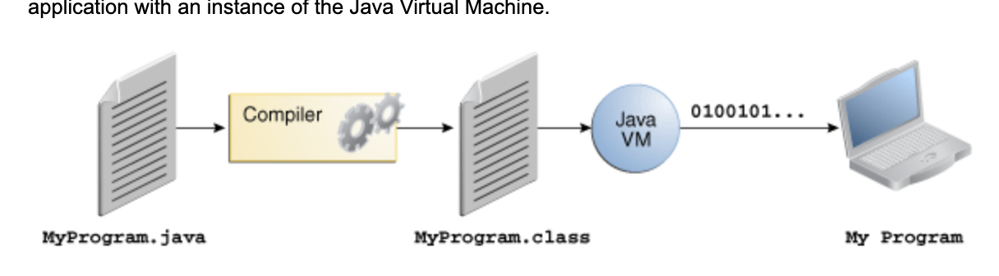
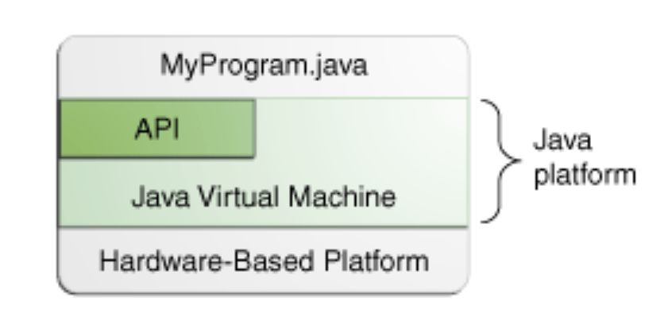

# 目次
- [目次](#目次)
- [概要](#概要)
  - [compile](#compile)
  - [java platform](#java-platform)
  - [comments](#comments)
  - [main method](#main-method)
- [class](#class)
  - [def](#def)
  - [inheritence](#inheritence)
  - [interface](#interface)
  - [package](#package)
- [variable](#variable)
  - [javaの変数の種類](#javaの変数の種類)
  - [命名](#命名)
  - [default value](#default-value)
  - [string literal](#string-literal)
  - [unmeric literal](#unmeric-literal)
- [Array](#array)
  - [array util](#array-util)
  - [for](#for)
  - [break](#break)


# 概要

## compile
- .javaファイルは.classファイルにコンパイルされる
- .classファイルをjvmが実行する
  

## java platform
- platformとは
  - ハードウェア
  - ソフトウェアの環境
- 他platformと以下の点で異なる
  - software-only
  - ハードウェア上で動くプラットフォーム上で動く
- 構成要素
  - jvm
  - api

  

## comments
- ３種類コメントがある
```java
// text

/* text */

/** document */
```

## main method
- java appはmainメソッドを含まなければならない

```java
public static void main(String[] args)
```

- mainメソッドがentrypoint
- argsでコマンドライン引数を受け取れる

```
$ java MyApp arg1 arg2
```

- フラグ引数は無視するので注意

```
$ java MyApp -arg1 -arg2
```

# class

## def

```java
class Name {
}
```

## inheritence

```java
class Foo extends Bar {}
```

## interface

- methodのグループ
  
```java
interface Bicycle {

    //  wheel revolutions per minute
    void changeCadence(int newValue);

    void changeGear(int newValue);

    void speedUp(int increment);

    void applyBrakes(int decrement);
}
```

- interfaceを満たすためには
  - implementsを使う
  - 必要なメソッドを定義
  - メソッドをpublicにする

```java
class ACMEBicycle implements Bicycle {

    int cadence = 0;
    int speed = 0;
    int gear = 1;

   // The compiler will now require that methods
   // changeCadence, changeGear, speedUp, and applyBrakes
   // all be implemented. Compilation will fail if those
   // methods are missing from this class.

    public void changeCadence(int newValue) {
         cadence = newValue;
    }

    public void changeGear(int newValue) {
         gear = newValue;
    }

    public void speedUp(int increment) {
         speed = speed + increment;   
    }

    public void applyBrakes(int decrement) {
         speed = speed - decrement;
    }

    public void printStates() {
         System.out.println("cadence:" +
             cadence + " speed:" + 
             speed + " gear:" + gear);
    }
}
```

## package
- classやinterfaceをまとめる名前空間

# variable
## javaの変数の種類
  - instance variable
    - 各インスタンスのproperty
  - class variable
    - class内部の静的な変数？
  - local variable
  - parameter
    - 引数のことか？
## 命名
- camel caseで名前をつける
- 定数はupper snake case

## default value
- 初期化しなくてもデフォルトが決まっている

## string literal
- char型はsingle quotation で初期化

```java
char c = 'C'
```

## unmeric literal
- アンダースコアで桁を区切ることができる
- 可読性が向上するらしい
  
```java
long creditCardNumber = 1234_5678_9012_3456L;
```

# Array
- 一つのデータ型が固定長で入っている
- 長さは初期化の時に決定

```java
// declares an array of integers
int[] anArray;

// allocates memory for 10 integers
anArray = new int[10];
    
// initialize first element
anArray[0] = 100;
```
## array util
- 配列をコピーする例
```java
class ArrayCopyDemo {
    public static void main(String[] args) {
        String[] copyFrom = {
            "Affogato", "Americano", "Cappuccino", "Corretto", "Cortado",   
            "Doppio", "Espresso", "Frappucino", "Freddo", "Lungo", "Macchiato",      
            "Marocchino", "Ristretto" };
         
        String[] copyTo = new String[7];
        System.arraycopy(copyFrom, 4, copyTo, 0, 7);
        for (String coffee : copyTo) {
            System.out.print(coffee + " ");           
        }
    }
}
```

- こっちのほうが直感的かも

```java
class ArrayCopyOfDemo {
    public static void main(String[] args) {
        String[] copyFrom = {
            "Affogato", "Americano", "Cappuccino", "Corretto", "Cortado",   
            "Doppio", "Espresso", "Frappucino", "Freddo", "Lungo", "Macchiato",      
            "Marocchino", "Ristretto" };
        
        String[] copyTo = java.util.Arrays.copyOfRange(copyFrom, 2, 9);        
        for (String coffee : copyTo) {
            System.out.print(coffee + " ");           
        }            
    }
}
```

- その他にもutilは揃っている
  - java.util.Arrays class

## for
- infinite loop
```java
for ( ; ; ) {
}
```

- iterate array
```java
for (int item : items) {
}
```

## break
- kinds
  - unlabeled break 
  - labeled break
- unlabeled break
  - loopを抜ける時に使用
- labeled break
```java
search: for (i = 0; i < arrayOfInts.length; i++) {
    for (j = 0; j < arrayOfInts[i].length; j++) {
        if (arrayOfInts[i][j] == searchfor) {
            foundIt = true;
            break search;
        }
    }
}
```